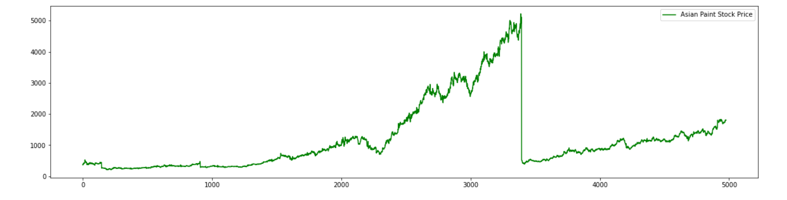
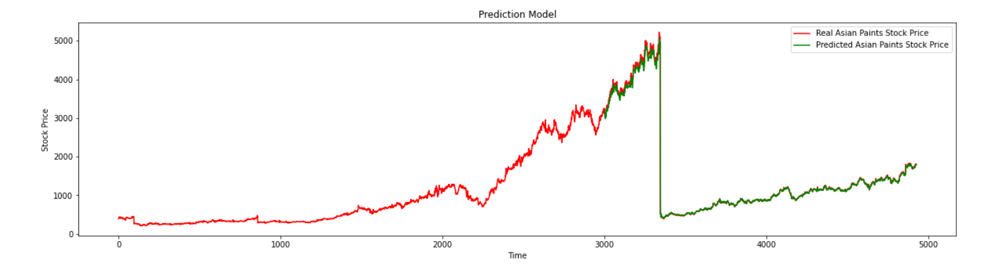

# Asian Paints Analysis of Stock Prices from 2000-2020

An LSTM model is built to predict the opening value of stock prices for each day since the year 2000. 

The data is cleaned first to remove all the 'NaN' values. Now the data has 4927 data points. Then a plot is made to visualize the prices from 2000 to 2020.  
 
After applying feature scaling, input data is provided to the LSTM in streams of 50 prices at a time.

# Architecture of the LSTM model:
1) An LSTM layer with 1000 nodes and input shape of 50 
2) Another LSTM layer with 500 nodes 
3) Dropout of 0.2 
4) A hidden dense layer with 128 nodes 
5) An output layer with one node 

The loss function used is 'mean_squared_error' and the optimizer used is 'adam'.

The model is trained on <b><u>3000 data points</u></b> for 200 epochs with batch size of 128.

# Predictions 

The prediction is made on the data points from 3000 to 4927. 

# RMSE Score

The rmse score is calculated out to be: 6.04%.

